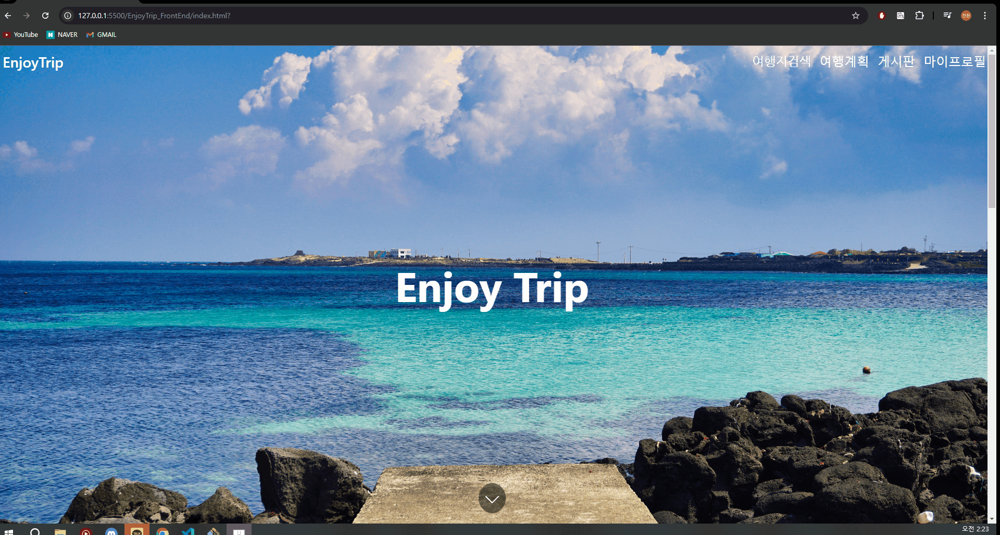

# 🧳 공공 데이터 활용 EnjoyTrip 서비스 🧳

## 🗺️ 프로젝트 소개 🗺️

    👨‍👩‍👦 예상 이용자 : 여행을 떠나고 싶은 사람들

    📜 제공 서비스 : 가고싶은 여행지의 관광지 정보, 진행 중인 축제 정보

## 🏖️ 요구 사항 🏖️

    1️⃣ 기본 기능

        ☑️ 메인 페이지 제작

        ☑️ 지역별 관광지 조회 페이지 제작

        ☑️ 로그인, 회원가입 페이지 제작

        ☑️ 회원관리 페이지 제작

    2️⃣ 추가 기능

        ☑️ 여행 계획 경로 제공 페이지 제작

## 🎡 구현 🎡

#### 📑 메인 페이지 제작

    📷 메인 페이지

코드 [index.html](https://lab.ssafy.com/alclsemtdl2022/EnjoyTrip_FrontEnd/-/blob/master/index.html?ref_type=heads)

#### 📑 지역별 관광지 조회 페이지 제작

    📷 지역별 관광지 조회 페이지

코드 [category_search.html](https://lab.ssafy.com/alclsemtdl2022/EnjoyTrip_FrontEnd/-/blob/master/category_search.html?ref_type=heads)

#### 📑 로그인, 회원가입 페이지 제작

    📷 로그인, 회원가입 페이지

코드 [sign_in_up.html](https://lab.ssafy.com/alclsemtdl2022/EnjoyTrip_FrontEnd/-/blob/master/sign_in_up.html?ref_type=heads)

#### 📑 회원관리 페이지 제작

    📷 회원관리 페이지

코드 [my_profile.html](https://lab.ssafy.com/alclsemtdl2022/EnjoyTrip_FrontEnd/-/blob/master/my_profile.html?ref_type=heads)

#### 📑 여행 계획 경로 제공 페이지 제작

    📷 여행 계획 경로 제공 페이지

코드 [tripPlan.html](https://lab.ssafy.com/alclsemtdl2022/EnjoyTrip_FrontEnd/-/blob/master/tripPlan.html?ref_type=heads)

## 🌉 개발 예정사항 🌉

    📅 나만의 핫플레이스 등록 페이지 제작

    📅 공지사항, 유저 게시판, 여행 관련 뉴스 게시판 페이지 제작
