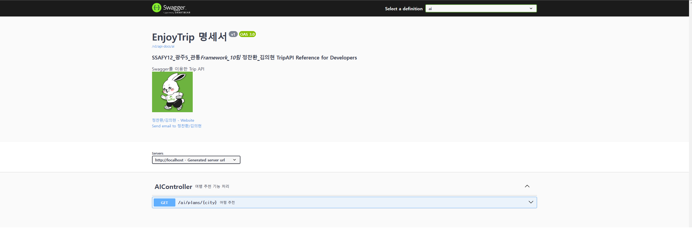
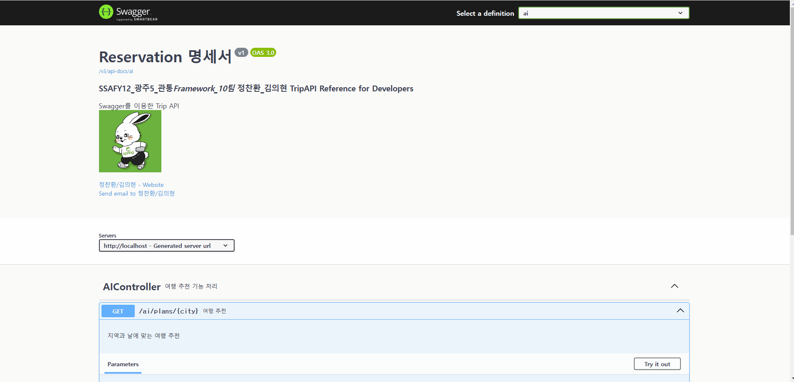

# 🧳 공공 데이터 활용 EnjoyTrip 서비스 🧳


## 🗺️ 프로젝트 소개 🗺️

    👨‍👩‍👦 예상 이용자 : 여행지는 정했지만 상세 일정은 짜지 못한 혼자 여행을 즐기는 사람

    📜 제공 서비스 : 관광지 정보 조회*추천, 회원 관리 시스템, 게시판 (공지사항, 자유게시판, hotplace) 기능

## 🏖️ 요구 사항 🏖️

    1️⃣ Spring Boot 프로젝트 구현

        ☑️ 기본 Backend 프로젝트를 SpringBoot 프로젝트로 전환

    2️⃣ 구현 기능

        ☑️ AI 관광지 추천 시스템 - 가고 싶은 도시를 선택하면, AI가 자동으로 그 도시의 관광지를 추천해줍니다.

        ☑️ 게시판 - 공지사항, 자유게시판, Hotplace 등록 게시판 기능 구현

        ☑️ 관광지 조회 - 트라이 자료구조를 활용한 검색어 자동완성 알고리즘 구현, 외판원 순회를 활용한 여행지 최적 경로 제공, 관광지 타입별 조회 기능

        ☑️ 회원 관리 시스템 - 로그인, 로그아웃, 회원 정보 수정, 회원 탈퇴, 회원가입, 임시 비밀번호 발급, BCrypt를 활용한 비밀번호 암호화 알고리즘 구현

## 🎡 구현 🎡

#### 📷 SpringBoot 프로젝트로 전환



#### 📑 코드

```java
package com.ssafy;

import org.springframework.boot.SpringApplication;
import org.springframework.boot.autoconfigure.SpringBootApplication;

@SpringBootApplication
public class EnjoyTripApplication {

	public static void main(String[] args) {
		SpringApplication.run(EnjoyTripApplication.class, args);
	}

}

```

#### 📷 AI 관광지 추천 시스템



##### 📑 코드

```java
package com.ssafy.openai.controller;

import org.springframework.ai.chat.messages.Message;
import org.springframework.ai.chat.messages.SystemMessage;
import org.springframework.ai.chat.messages.UserMessage;
import org.springframework.ai.chat.model.ChatModel;
import org.springframework.ai.chat.prompt.PromptTemplate;
import org.springframework.http.HttpStatus;
import org.springframework.http.ResponseEntity;
import org.springframework.web.bind.annotation.CrossOrigin;
import org.springframework.web.bind.annotation.GetMapping;
import org.springframework.web.bind.annotation.PathVariable;
import org.springframework.web.bind.annotation.RequestMapping;
import org.springframework.web.bind.annotation.RestController;

import com.ssafy.openai.util.PromptTemplateLoader;

import io.swagger.v3.oas.annotations.Operation;
import io.swagger.v3.oas.annotations.tags.Tag;
import lombok.extern.slf4j.Slf4j;

@Slf4j
@RestController
//@CrossOrigin("*")
@RequestMapping("/ai")
@Tag(name = "AIController", description = "여행 추천 기능 처리")
public class AIController {

	private final ChatModel chatModel;
	private final PromptTemplateLoader promptLoader;

	public AIController(ChatModel chatModel, PromptTemplateLoader promptLoader) {
		super();
		this.chatModel = chatModel;
		this.promptLoader = promptLoader;
	}


	@GetMapping("/plans/{city}")
	@Operation(summary = "여행 추천", description = "지역과 날에 맞는 여행 추천")
    public ResponseEntity<String> getAttractions(@PathVariable("city") String city) {
        try {
            // 유저 프롬프트 템플릿 로드 및 변수 설정
            String userPromptTemplate = promptLoader.loadUserPrompt();
            PromptTemplate userTemplate = new PromptTemplate(userPromptTemplate);
            userTemplate.add("city", city);
            String userCommand = userTemplate.render();

            // 시스템 프롬프트 로드
            String systemPromptTemplate = promptLoader.loadSystemPrompt();
            PromptTemplate systemTemplate = new PromptTemplate(systemPromptTemplate);
            String systemCommand = systemTemplate.render();

            // 메시지 생성
            Message userMessage = new UserMessage(userCommand);
            Message systemMessage = new SystemMessage(systemCommand);

            // API 호출
            String response = chatModel.call(userMessage, systemMessage);
            System.out.println(response);
//            log.info("Generated response for city: {}, day: {}", city, day);

            return ResponseEntity.ok(response);

        } catch (Exception e) {
//            log.error("Error processing attraction request for city: " + city, e);
            return ResponseEntity.status(HttpStatus.INTERNAL_SERVER_ERROR)
                .body("Error processing request: " + e.getMessage());
        }
    }

}
```

#### 📷 게시판


##### 📑 코드

```java
package com.ssafy.board.controller;

import java.util.List;
import java.util.Objects;

import org.springframework.beans.factory.annotation.Autowired;
import org.springframework.http.HttpStatus;
import org.springframework.http.ResponseEntity;
import org.springframework.web.bind.annotation.PostMapping;
import org.springframework.web.bind.annotation.RequestMapping;
import org.springframework.web.bind.annotation.RequestParam;
import org.springframework.web.bind.annotation.RestController;

import com.ssafy.board.model.dto.BoardDto;
import com.ssafy.board.model.service.BoardService;

import io.swagger.v3.oas.annotations.Operation;
import io.swagger.v3.oas.annotations.tags.Tag;
import lombok.extern.slf4j.Slf4j;

@Slf4j
@RestController
@RequestMapping("/board")
@Tag(name = "BoardController", description = "게시판 관리 기능 제공")
public class BoardController {
	private BoardService boardService;

	@Autowired
	public BoardController(BoardService boardService) {
		this.boardService = boardService;
	}

	@Operation(summary = "게시글 등록", description = "새로운 게시글을 등록합니다.")
	@PostMapping("/insert")
	public ResponseEntity<?> insert(BoardDto boardDto) {
		try {
			int cnt = boardService.insert(boardDto);
			if (cnt == 1) {
				return ResponseEntity.ok().build();
			} else {
				return ResponseEntity.status(HttpStatus.BAD_REQUEST).build();
			}
		} catch (Exception e) {
			e.printStackTrace();
			return ResponseEntity.status(HttpStatus.INTERNAL_SERVER_ERROR).build();
		}
	}

	@Operation(summary = "게시글 삭제", description = "게시글 ID를 사용하여 게시글을 삭제합니다.")
	@PostMapping("/delete")
	public ResponseEntity<?> delete(@RequestParam("boardId") int boardId) {
		try {
			int cnt = boardService.delete(boardId);
			if (cnt == 1) {
				return ResponseEntity.ok().build();
			} else {
				return ResponseEntity.status(HttpStatus.BAD_REQUEST).build();
			}
		} catch (Exception e) {
			e.printStackTrace();
			return ResponseEntity.status(HttpStatus.INTERNAL_SERVER_ERROR).build();
		}
	}

	@Operation(summary = "게시글 수정", description = "기존 게시글의 내용을 수정합니다.")
	@PostMapping("/update")
	public ResponseEntity<?> update(BoardDto boardDto) {
		try {
			int cnt = boardService.update(boardDto);
			if (cnt == 1) {
				return ResponseEntity.ok().build();
			} else {
				return ResponseEntity.status(HttpStatus.BAD_REQUEST).build();
			}
		} catch (Exception e) {
			e.printStackTrace();
			return ResponseEntity.status(HttpStatus.INTERNAL_SERVER_ERROR).build();
		}
	}

	@Operation(summary = "전체 게시글 목록 조회", description = "모든 게시글 목록을 조회합니다.")
	@PostMapping("/list/all")
	public ResponseEntity<?> listALL() {
		try {
			List<BoardDto> list = boardService.listAll();
			if (Objects.isNull(list)) {
				return ResponseEntity.status(HttpStatus.INTERNAL_SERVER_ERROR).build();
			} else {
				return ResponseEntity.ok(list);
			}
		} catch (Exception e) {
			e.printStackTrace();
			return ResponseEntity.status(HttpStatus.INTERNAL_SERVER_ERROR).build();
		}
	}

	@Operation(summary = "카테고리별 게시글 조회", description = "특정 카테고리에 속하는 게시글 목록을 조회합니다.")
	@PostMapping("/list/category")
	public ResponseEntity<?> listCategory(@RequestParam(value = "categoryId") String categoryId) {
		try {
			List<BoardDto> list = boardService.listByCategory(categoryId);
			if (Objects.isNull(list)) {
				return ResponseEntity.status(HttpStatus.BAD_REQUEST).build();
			} else {
				return ResponseEntity.ok(list);
			}
		} catch (Exception e) {
			e.printStackTrace();
			return ResponseEntity.status(HttpStatus.INTERNAL_SERVER_ERROR).build();
		}
	}

	@Operation(summary = "게시글 상세 조회", description = "게시글 ID를 사용하여 게시글의 상세 정보를 조회합니다.")
	@PostMapping("/detail")
	public ResponseEntity<?> detail(@RequestParam(value = "boardId") int boardId) {
		try {
			BoardDto boardDto = boardService.detail(boardId);
			if (Objects.isNull(boardDto)) {
				return ResponseEntity.status(HttpStatus.BAD_REQUEST).build();
			} else {
				return ResponseEntity.ok(boardDto);
			}
		} catch (Exception e) {
			e.printStackTrace();
			return ResponseEntity.status(HttpStatus.INTERNAL_SERVER_ERROR).build();
		}
	}
}
```

#### 📷 관광지 조회


##### 📑 코드

```java
package com.ssafy.trip.controller;

import java.io.IOException;
import java.nio.charset.StandardCharsets;
import java.util.ArrayList;
import java.util.HashMap;
import java.util.List;
import java.util.Map;

import org.springframework.http.HttpHeaders;
import org.springframework.http.HttpStatus;
import org.springframework.http.MediaType;
import org.springframework.http.ResponseEntity;
import org.springframework.web.bind.annotation.PostMapping;
import org.springframework.web.bind.annotation.RequestBody;
import org.springframework.web.bind.annotation.RequestMapping;
import org.springframework.web.bind.annotation.RequestParam;
import org.springframework.web.bind.annotation.RestController;

import com.ssafy.trip.dto.request.RecommandPathRequest;
import com.ssafy.trip.dto.request.TripDetailRequest;
import com.ssafy.trip.dto.request.TripListRequest;
import com.ssafy.trip.dto.request.TripTrieSearchRequest;
import com.ssafy.trip.dto.response.TripDetailResponse;
import com.ssafy.trip.dto.response.TripListResponse;
import com.ssafy.trip.dto.response.TripTrieSearchResponse;
import com.ssafy.trip.model.TripDto;
import com.ssafy.trip.model.service.TripService;
import com.ssafy.util.PageNavigation;

import io.swagger.v3.oas.annotations.Operation;
import io.swagger.v3.oas.annotations.media.Content;
import io.swagger.v3.oas.annotations.media.Schema;
import io.swagger.v3.oas.annotations.responses.ApiResponse;
import io.swagger.v3.oas.annotations.responses.ApiResponses;
import io.swagger.v3.oas.annotations.tags.Tag;
import jakarta.servlet.http.HttpServletRequest;
import jakarta.servlet.http.HttpServletResponse;
import jakarta.validation.Valid;
import lombok.RequiredArgsConstructor;

@RestController
@RequiredArgsConstructor
@RequestMapping("/trip")
@Tag(name = "Trip", description = "여행 관련 API")
public class TripController {

    private final TripService tripService;

    @Operation(summary = "여행 목록 조회", description = "검색 조건에 따라 여행 목록을 조회합니다.")
    @ApiResponses(value = {
            @ApiResponse(responseCode = "200", description = "성공", content = @Content(schema = @Schema(implementation = TripListResponse.class))),
            @ApiResponse(responseCode = "400", description = "잘못된 요청", content = @Content)
    })
    @PostMapping("/list")
    public ResponseEntity<?> tripList(@RequestBody TripListRequest tripListRequest) {

    	if (tripListRequest.getPgno() <= 0) {
    		tripListRequest.setPgno(1);
    	}

        TripListResponse tripListResponse = new TripListResponse();
        // 검색 조건 출력(디버깅용)
        System.out.println("pgno: " + tripListRequest.getPgno());
        System.out.println("code: " + tripListRequest.getCode());
        System.out.println("type: " + tripListRequest.getType());
        System.out.println("name: " + tripListRequest.getName());

        Map<String, String> map = new HashMap<>();
        map.put("pgno", String.valueOf(tripListRequest.getPgno()));
        map.put("code", tripListRequest.getCode());
        map.put("type", tripListRequest.getType());
        map.put("name", tripListRequest.getName());

        // 시도 목록과 콘텐츠 타입 목록 설정
        tripListResponse.setSidoList(tripService.searchListAreaInfo());
        tripListResponse.setContentTypeList(tripService.searchListContentType());

        // 페이지 네비게이션 처리
        try {
            PageNavigation pageNavigation = tripService.makePageNavigation(map);
            tripListResponse.setPageNavigation(pageNavigation);
        } catch (Exception e) {
            e.printStackTrace();
            return ResponseEntity.status(HttpStatus.BAD_REQUEST).build();
        }

        try {
            tripListResponse.setTripList(tripService.searchTripList(tripListRequest));
        } catch (Exception e) {
            e.printStackTrace();
            return ResponseEntity.status(HttpStatus.BAD_REQUEST).build();
        }

        return new ResponseEntity<>(tripListResponse, HttpStatus.OK);
    }

    @Operation(summary = "여행 상세 조회", description = "여행 상세 정보를 조회합니다.")
    @ApiResponses(value = {
            @ApiResponse(responseCode = "200", description = "성공", content = @Content(schema = @Schema(implementation = TripDetailResponse.class))),
            @ApiResponse(responseCode = "400", description = "잘못된 요청", content = @Content)
    })
    @PostMapping("/detail")
    public ResponseEntity<?> tripDetail(@Valid @RequestBody TripDetailRequest tripDetailRequest) {

        TripDetailResponse tripDetailResponse = new TripDetailResponse();

        try {
            System.out.println(tripDetailRequest.getCode());
            TripDto tripDto = (TripDto) tripService.viewTrip(Integer.parseInt(tripDetailRequest.getCode()));
            List<TripDto> nearTripDto = new ArrayList<>();
            nearTripDto = tripService.getNearTrip(tripDto.getLatitude(), tripDto.getLongitude());
            tripDetailResponse.setTrip(tripDto);
            tripDetailResponse.setNearTripList(nearTripDto);
        } catch (Exception e) {
            e.printStackTrace();
            return ResponseEntity.status(HttpStatus.BAD_REQUEST).build();
        }
        return ResponseEntity.ok().body(tripDetailResponse);
    }

    @Operation(summary = "여행 트라이 검색", description = "트라이 구조를 사용하여 여행 검색을 수행합니다.")
    @ApiResponses(value = {
            @ApiResponse(responseCode = "200", description = "성공", content = @Content(schema = @Schema(implementation = TripTrieSearchResponse.class))),
            @ApiResponse(responseCode = "400", description = "잘못된 요청", content = @Content)
    })
    @PostMapping("/trieSearch")
    public ResponseEntity<?> trieSearch(@Valid @RequestBody TripTrieSearchRequest tripTrieSearchRequest) {

        Map<String, Object> map = new HashMap<>();
        map.put("code", tripTrieSearchRequest.getCode());
        map.put("type", tripTrieSearchRequest.getType());
        map.put("name", tripTrieSearchRequest.getName());

        TripTrieSearchResponse tripTrieSearchResponse = new TripTrieSearchResponse();
        tripTrieSearchResponse.setTrieList(tripService.getTrieList(map));
        return ResponseEntity.ok().body(tripTrieSearchRequest);
    }

    @Operation(summary = "여행 경로 추천", description = "외판원 순회를 통해 출발지, 경유지, 도착지 사이의 최적 경로를 제공합니다.")
    @PostMapping("/getPath")
    private ResponseEntity<?> getPath(@Valid @RequestBody RecommandPathRequest recommandPathRequest) {
	    try {
	        int startId = Integer.parseInt(recommandPathRequest.getStartId());
	        int endId = Integer.parseInt(recommandPathRequest.getEndId());

	        List<Integer> waypointIds = new ArrayList<>();
	        for (String waypointIdStr : recommandPathRequest.getWaypointIds()) {
	            waypointIds.add(Integer.parseInt(waypointIdStr));
	        }

	        List<TripDto> optimalPath = tripService.findOptimalPath(startId, waypointIds, endId);
	        System.out.println(optimalPath);

	        if (optimalPath.isEmpty()) {
	            return ResponseEntity.status(HttpStatus.INTERNAL_SERVER_ERROR).build();
	        }

	        // 최적 경로를 JSON으로 변환
	        HttpHeaders headers = new HttpHeaders();
	        headers.setContentType(new MediaType("application", "json", StandardCharsets.UTF_8));

	        return ResponseEntity.ok().headers(headers).body(optimalPath);
	    } catch (Exception e) {
	        e.printStackTrace();
	        return ResponseEntity.status(HttpStatus.INTERNAL_SERVER_ERROR).build();
	    }
	}


    @Operation(summary = "여행 경로 선택", description = "출발지, 도착지, 경유지 순서대로 가고싶은 여행지를 선택합니다.")
    @PostMapping("/selectAttraction")
	private ResponseEntity<?> selectAttraction(@RequestParam(value = "contentId") int contentId) throws IOException {

	    try {
	        TripDto attraction = tripService.viewTrip(contentId);
	        if (attraction == null) {
	        	return ResponseEntity.status(HttpStatus.BAD_REQUEST).build();
	        }

	        HttpHeaders headers = new HttpHeaders();
	        headers.setContentType(new MediaType("application", "json", StandardCharsets.UTF_8));

	        return ResponseEntity.ok().headers(headers).body(attraction);
	    } catch (NumberFormatException e) {
	        // 유효하지 않은 contentId 형식
	        return ResponseEntity.status(HttpStatus.BAD_REQUEST).build();
	    } catch (Exception e) {
	        e.printStackTrace();
	        return ResponseEntity.status(HttpStatus.INTERNAL_SERVER_ERROR).build();
	    }
	}

}
```

#### 📷 회원 조회


##### 📑 코드

```java
package com.ssafy.member.controller;

import java.nio.charset.StandardCharsets;
import java.sql.SQLException;
import java.util.HashMap;
import java.util.Map;
import java.util.Objects;
import java.util.Random;

import org.springframework.beans.factory.annotation.Autowired;
import org.springframework.http.HttpHeaders;
import org.springframework.http.HttpStatus;
import org.springframework.http.MediaType;
import org.springframework.http.ResponseEntity;
import org.springframework.web.bind.annotation.GetMapping;
import org.springframework.web.bind.annotation.PathVariable;
import org.springframework.web.bind.annotation.PostMapping;
import org.springframework.web.bind.annotation.RequestMapping;
import org.springframework.web.bind.annotation.RequestParam;
import org.springframework.web.bind.annotation.RestController;

import com.ssafy.member.model.MemberDto;
import com.ssafy.member.model.service.MemberService;
import com.ssafy.util.PasswordUtil;

import io.swagger.v3.oas.annotations.Operation;
import io.swagger.v3.oas.annotations.tags.Tag;
import jakarta.servlet.http.Cookie;
import jakarta.servlet.http.HttpServletRequest;
import jakarta.servlet.http.HttpServletResponse;
import jakarta.servlet.http.HttpSession;
import lombok.extern.slf4j.Slf4j;

@Slf4j
@RestController
@RequestMapping("/member")
@Tag(name = "MemberController", description = "로그인, 로그아웃, 회원가입, 회원정보수정, 회원탈퇴 기능 처리")
public class MemberController {

	private MemberService memberService;

	@Autowired
	public MemberController(MemberService memberService) {
		this.memberService = memberService;
	}

	@PostMapping("/login")
	@Operation(summary = "로그인", description = "유저의 로그인 정보를 인증하고 성공 시 세션을 시작합니다.")
	public ResponseEntity<?> login(@RequestParam Map<String, String> map, HttpSession httpSession, HttpServletResponse response, HttpServletRequest request) {
		try {
			MemberDto loginUser = memberService.login(map);

			if (!Objects.isNull(loginUser)) {
				httpSession.setAttribute("loginUser", loginUser);

				if ("on".equals(map.get("remember"))) {
					Cookie cookie = new Cookie("remeberId", loginUser.getUserId());
					cookie.setMaxAge(60*60*24*365*29);
					response.addCookie(cookie);
				} else {
					Cookie[] cookies = request.getCookies();
					for (Cookie cookie : cookies) {
						if (cookie.getName().equals("rememberId")) {
							cookie.setMaxAge(0);
							response.addCookie(cookie);
						}
					}
				}

				HttpHeaders headers = new HttpHeaders();
                headers.setContentType(new MediaType("application", "json", StandardCharsets.UTF_8));

				// 로그인 성공
				return ResponseEntity.ok().build();
			} else {
				// 로그인 실패
				return ResponseEntity.status(HttpStatus.BAD_REQUEST).build();
			}
		} catch (SQLException e) {
			e.printStackTrace();
			// 서버 에러
			return ResponseEntity.status(HttpStatus.INTERNAL_SERVER_ERROR).build();
		}
	}

	@PostMapping("/logout")
	@Operation(summary = "로그아웃", description = "유저의 로그인 정보를 세션에서 제거합니다.")
	public ResponseEntity<?> logout(HttpSession httpSession) {
		MemberDto loginUser = (MemberDto) httpSession.getAttribute("loginUser");

		if (!Objects.isNull(loginUser)) {
			httpSession.invalidate();
			return ResponseEntity.ok().build();
		} else {
			return ResponseEntity.status(HttpStatus.BAD_REQUEST).build();
		}
	}

	@PostMapping("/regist")
	@Operation(summary = "회원가입", description = "새로운 유저를 등록하고 회원가입 절차를 완료합니다.")
	public ResponseEntity<?> regist(MemberDto memberDto) {
		try {
			int cnt = memberService.regist(memberDto);

			if (cnt == 1) {
				return ResponseEntity.ok().build();
			} else {
				return ResponseEntity.status(HttpStatus.BAD_REQUEST).build();
			}
		} catch (SQLException e) {
			e.printStackTrace();
			return ResponseEntity.status(HttpStatus.INTERNAL_SERVER_ERROR).build();
		}
	}

	@PostMapping("/modify")
	@Operation(summary = "회원 정보 수정", description = "새로운 유저를 등록하고 회원가입 절차를 완료합니다.")
	public ResponseEntity<?> modify(MemberDto memberDto) {
		try {
			int cnt = memberService.modify(memberDto);

			if (cnt == 1) {
				return ResponseEntity.ok().build();
			} else {
				return ResponseEntity.status(HttpStatus.BAD_REQUEST).build();
			}
		} catch (SQLException e) {
			e.printStackTrace();
			return ResponseEntity.status(HttpStatus.INTERNAL_SERVER_ERROR).build();
		}
	}

	@PostMapping("/delete")
	@Operation(summary = "회원탈퇴", description = "유저의 정보를 영구적으로 삭제합니다.")
	public ResponseEntity<?> delete(@RequestParam(value = "userId") String userId) {
		try {
			int cnt = memberService.delete(userId);

			if (cnt == 1) {
				return ResponseEntity.ok().build();
			} else {
				return ResponseEntity.status(HttpStatus.BAD_REQUEST).build();
			}
		} catch (SQLException e) {
			e.printStackTrace();
			return ResponseEntity.status(HttpStatus.INTERNAL_SERVER_ERROR).build();

		}
	}

	@GetMapping("/idCheck/{userId}")
	@Operation(summary = "중복 아이디 확인", description = "유저의 회원 가입 시 같은 아이디가 있는지 확인합니다.")
	public ResponseEntity<?> idCheck(@PathVariable(value = "userId") String userId) {
		try {
			Map<String, Boolean> map = new HashMap<>();
			map.put("bool", memberService.idCheck(userId));

			HttpHeaders headers = new HttpHeaders();
			headers.setContentType(new MediaType("application", "json", StandardCharsets.UTF_8));
			return ResponseEntity.ok().headers(headers).body(map);
		} catch (SQLException e) {
			e.printStackTrace();
			return ResponseEntity.status(HttpStatus.INTERNAL_SERVER_ERROR).build();
		}
	}

	@PostMapping("/passwordCheck")
	@Operation(summary = "비밀번호 확인", description = "유저의 개인 정보 확인 시 비밀번호를 확인합니다.")
	public ResponseEntity<?> passwordCheck(HttpSession httpSession, @RequestParam(value = "userPassword") String userPassword) {
		MemberDto loginUser = (MemberDto) httpSession.getAttribute("loginUser");

		HttpHeaders headers = new HttpHeaders();
		headers.setContentType(new MediaType("application", "json", StandardCharsets.UTF_8));
		return ResponseEntity.ok().headers(headers).body(PasswordUtil.checkPassword(userPassword, loginUser.getUserPassword()));
	}


	@PostMapping("/newPassword")
	@Operation(summary = "임시 비밀번호 발급", description = "알파벳 대/소문자, 숫자로 이루어진 8자리의 새로운 임시 비밀번호를 발급합니다.")
	public ResponseEntity<?> newPassword(@RequestParam Map<String, String> map) {
        String chars = "ABCDEFGHIJKLMNOPQRSTUVWXYZabcdefghijklmnopqrstuvwxyz0123456789";
        Random random = new Random();
        StringBuilder newPassword = new StringBuilder();
        for (int i = 0; i < 8; i++) {
            int index = random.nextInt(chars.length());
            newPassword.append(chars.charAt(index));
        }
        String password = newPassword.toString();

        MemberDto memberDto = new MemberDto();
        memberDto.setUserId(map.get("userId"));
        memberDto.setUserName(map.get("userName"));
        memberDto.setEmail(map.get("email"));
        memberDto.setUserPassword(password);

        try {
			if (memberService.modifyPassword(memberDto) == 1) {
				HttpHeaders headers = new HttpHeaders();
				headers.setContentType(new MediaType("application", "json", StandardCharsets.UTF_8));
				return ResponseEntity.ok().headers(headers).body(memberDto.getUserPassword());
			} else {
				return ResponseEntity.status(HttpStatus.BAD_REQUEST).build();
			}
		} catch (SQLException e) {
			e.printStackTrace();
			return ResponseEntity.status(HttpStatus.INTERNAL_SERVER_ERROR).build();
		}
	}
}
```
